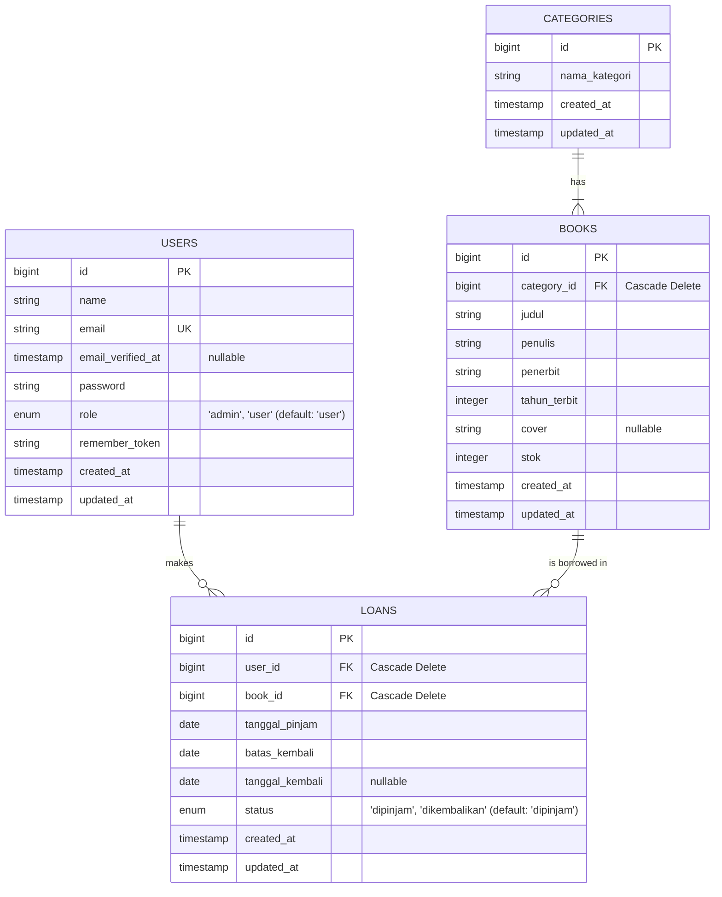

# Database Schema

This document provides a comprehensive overview of the database schema for the Libera School Library application. The system uses an SQL relational database via Laravel's Eloquent ORM.

## Entity Relationship Diagram (ERD)

## Tables Reference

### `users`
Stores all user information, distinguishing between administrators and standard users via the `role` field.
*   **id**: `bigint` - Primary Key
*   **name**: `varchar` - Full name of the user
*   **email**: `varchar` - Unique email address for login
*   **email_verified_at**: `timestamp` - (Nullable) Verification timestamp
*   **password**: `varchar` - Hashed password
*   **role**: `enum('admin', 'user')` - Defines the user's access level (default: `user`)
*   **remember_token**: `varchar` - Token for 'remember me' functionality
*   **created_at**, **updated_at**: `timestamp`

*Note: The `users` migration also creates standard standard Laravel `password_reset_tokens` and `sessions` tables for authentication functionality.*

### `categories`
Stores different book categories/genres.
*   **id**: `bigint` - Primary Key
*   **nama_kategori**: `varchar` - Name of the category
*   **created_at**, **updated_at**: `timestamp`

### `books`
Stores the library's physical inventory.
*   **id**: `bigint` - Primary Key
*   **category_id**: `bigint` - Foreign Key linking to `categories.id`
*   **judul**: `varchar` - Title of the book
*   **penulis**: `varchar` - Author of the book
*   **penerbit**: `varchar` - Publisher of the book
*   **tahun_terbit**: `integer` - Year of publication
*   **cover**: `varchar` - (Nullable) Path to the book's cover image
*   **stok**: `integer` - Number of copies currently available
*   **created_at**, **updated_at**: `timestamp`

### `loans`
Tracks book borrowing transactions.
*   **id**: `bigint` - Primary Key
*   **user_id**: `bigint` - Foreign Key linking to `users.id` (The student borrowing)
*   **book_id**: `bigint` - Foreign Key linking to `books.id` (The book being borrowed)
*   **tanggal_pinjam**: `date` - The start date of the loan
*   **batas_kembali**: `date` - The due date for the return
*   **tanggal_kembali**: `date` - (Nullable) The actual date the book was returned
*   **status**: `enum('dipinjam', 'dikembalikan')` - Tracking state of the loan (default: `dipinjam`)
*   **created_at**, **updated_at**: `timestamp`
